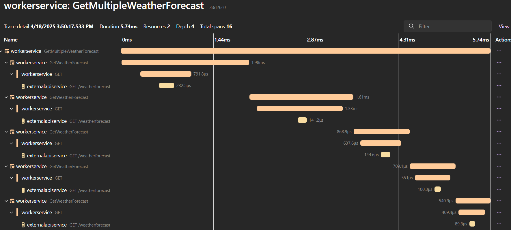

# aspire-logging-tracing-metrics-samples

> **Custom Activities in Tracing**
>
> This sample demonstrates how to add custom activities to tracing using a dedicated `ActivitySource`.  
> The `distributed-app-demo.ServiceDefaults.ActivitySources` class defines a constant `CustomActivities` which is used as the name for the custom `ActivitySource`.  
> When you create activities using this source, they will appear in the traces and logs, allowing you to track custom operations in your application.
>
> Example:
> ```csharp
> using var activitySource = new ActivitySource(ActivitySources.CustomActivities);
> using var activity = activitySource.StartActivity("MyCustomOperation");
> // ... your code ...
> ```
> See [`ActivitySources.cs`](distributed-app-demo.ServiceDefaults/ActivitySources.cs) for the definition.

Multiple activities from a single process:

Traces:



Logs:


> **Custom TraceId in Tracing**
>
> This sample demonstrates how to create activities with a custom `TraceId` using `ActivityContext`.
> By providing your own `TraceId`, you can correlate traces across services or processes, or inject a known trace identifier for testing and diagnostics.
>
> Example:
> ```csharp
> // Must be 32 characters long
> var existingTraceId = Guid.NewGuid().ToString("N");
> var context = new ActivityContext(
>     traceId: ActivityTraceId.CreateFromString(existingTraceId),
>     spanId: ActivitySpanId.CreateRandom(),
>     traceFlags: ActivityTraceFlags.Recorded,
>     isRemote: true);
> using var activity = activitySource.StartActivity("GetWeatherForecast", ActivityKind.Consumer, context);
> // ... your code ...
> ```
> See [`WeatherWorker.cs`](distributed-app-demo.WorkerService/WeatherWorker.cs) for a complete example.

Activity with existing TraceId:

